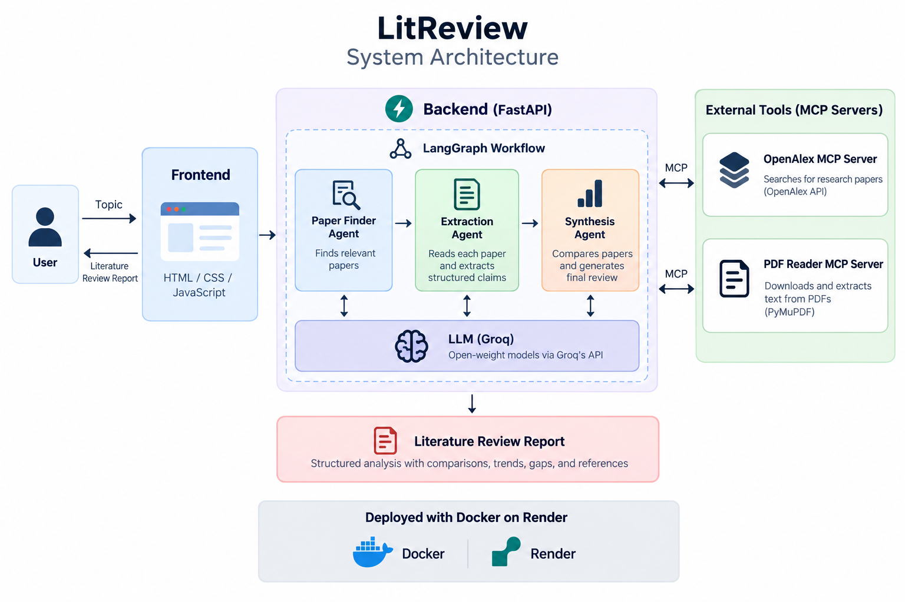

# LitReview — Multi-Agent Literature Review Assistant

**Live demo:** https://litreview-rskm.onrender.com/
*(Free-tier hosting — the app may take 30–60s to wake up if it's been idle.)*

LitReview takes a research topic, finds relevant papers, extracts each paper's
claims into a structured schema, and synthesizes those claims into a literature
review — surfacing consensus, contradictions, and methodological trends across
papers, instead of just summarizing each paper individually.

## Why this exists

Reviewing a body of research means tracking which papers agree, which conflict,
and how the field has moved over time. Most "AI paper summarizer" tools stop at
describing each paper on its own — the real work is *comparing across* papers.
This project automates that comparison step, motivated by a real bottleneck
encountered while comparing methods across papers for a lunar terrain
segmentation project.

## Architecture




```
                    FastAPI backend + static frontend
                                │
                    LangGraph Orchestrator
                    state: { topic, papers, extracted_claims, synthesis }
                                │
                                ▼
                    Paper Finder Agent
                    → MCP tool: search_papers(topic)   [OpenAlex]
                                │
                          [papers list]
                                ▼
                    Extraction Agent
                    → MCP tool: fetch_paper(id, pdf_url)
                    → extracts structured schema per paper:
                        problem, method, dataset, metric,
                        result, limitation, section
                                │
                        [structured claims]
                                ▼
                    Synthesis Agent
                    → consensus, contradictions, trend timeline,
                      comparison table, research landscape, gaps
                                │
                                ▼
                    Final structured Markdown report
```

Two standalone MCP servers expose the external-data tools (`search_papers`,
`fetch_paper`), called over the Model Context Protocol via a generic MCP
client rather than as in-process function calls — keeping agent reasoning
cleanly separated from external data access.

## Tech stack

| Layer | Tool |
|---|---|
| Orchestration | LangGraph |
| Tool protocol | MCP (2 servers: paper search, paper fetch) |
| Paper search | OpenAlex API (250M+ papers, free) |
| PDF fetch & parsing | Direct download from each paper's open-access PDF URL, text extraction via PyMuPDF |
| LLM | Groq (`openai/gpt-oss-20b` for extraction, `openai/gpt-oss-120b` for synthesis) |
| Backend | FastAPI |
| Frontend | Custom HTML/CSS/JS (no framework) |
| Containerization | Docker |
| Deployment | Render (free tier) |

## Resilience by design

External research APIs are frequently rate-limited or incomplete in practice.
LitReview is built to degrade gracefully rather than fail:

- If live paper search fails, the system falls back to a small cached set of
  real papers so the rest of the pipeline can still run.
- If full-text fetch fails for a given paper (no open-access PDF, or the host
  blocks scripted downloads), extraction falls back to that paper's abstract
  instead of failing the whole run — and abstracts alone still produce
  strong, specific synthesis output in practice.
- LLM calls retry with backoff on malformed or truncated JSON output before
  failing.

This resilience was driven by real failures encountered during development —
arXiv's export API rate-limiting an entire session, Gemini's free tier being
cut ~10x platform-wide, Semantic Scholar's shared global rate limit, and
publisher sites (Elsevier, Hindawi) blocking scripted PDF downloads even on
papers marked open access.

## Project structure

```
LitReview/
├── mcp_servers/
│   ├── arxiv_search/server.py   # search_papers MCP tool (OpenAlex-backed)
│   └── paper_fetch/server.py    # fetch_paper MCP tool
├── agents/
│   ├── finder_agent.py          # Paper Finder Agent
│   ├── extraction_agent.py      # Extraction Agent
│   ├── synthesis_agent.py       # Synthesis Agent
│   └── orchestrator.py          # LangGraph orchestrator
├── eval/
│   ├── queries.json             # Curated eval query set
│   └── run_eval.py              # Eval harness
├── data/
│   └── sample_papers.json       # Cached fallback fixture
├── static/
│   └── index.html               # Frontend
├── mcp_client.py                 # Generic MCP client wiring
├── report_formatter.py           # Markdown report formatter
├── backend.py                    # FastAPI app (serves API + frontend)
├── Dockerfile
├── .dockerignore
└── requirements.txt
```

## Setup

```bash
python -m venv litenv
litenv\Scripts\activate        # Windows
pip install -r requirements.txt
```

Create a `.env` file:
```
GROQ_API_KEY=your-key-here
OPENALEX_API_KEY=your-key-here   # optional but recommended — instant, free, at openalex.org/settings/api
```

## Running locally

```bash
uvicorn backend:app --reload --port 8000
```
Open `http://localhost:8000`.

## Running with Docker

```bash
docker build -t litreview .
docker run -p 7860:7860 --env-file .env litreview
```
Open `http://localhost:7860`.

## Evaluation

```bash
python eval/run_eval.py
```

A curated set of topic queries in a known domain (lunar terrain/crater
research), each with an expected consensus/contradiction relationship
verified by hand. The system's synthesis output is scored against that
expectation as a single pass/fail per query.

## Deployment

Deployed on [Render](https://render.com) (free tier, Docker web service),
auto-deploying from this repository's `main` branch. `GROQ_API_KEY` and
`OPENALEX_API_KEY` are set as environment variables in Render's dashboard.

## Status

Complete and deployed. Core pipeline (Finder → Extraction → Synthesis →
Report) works end-to-end with a live UI at the link above.